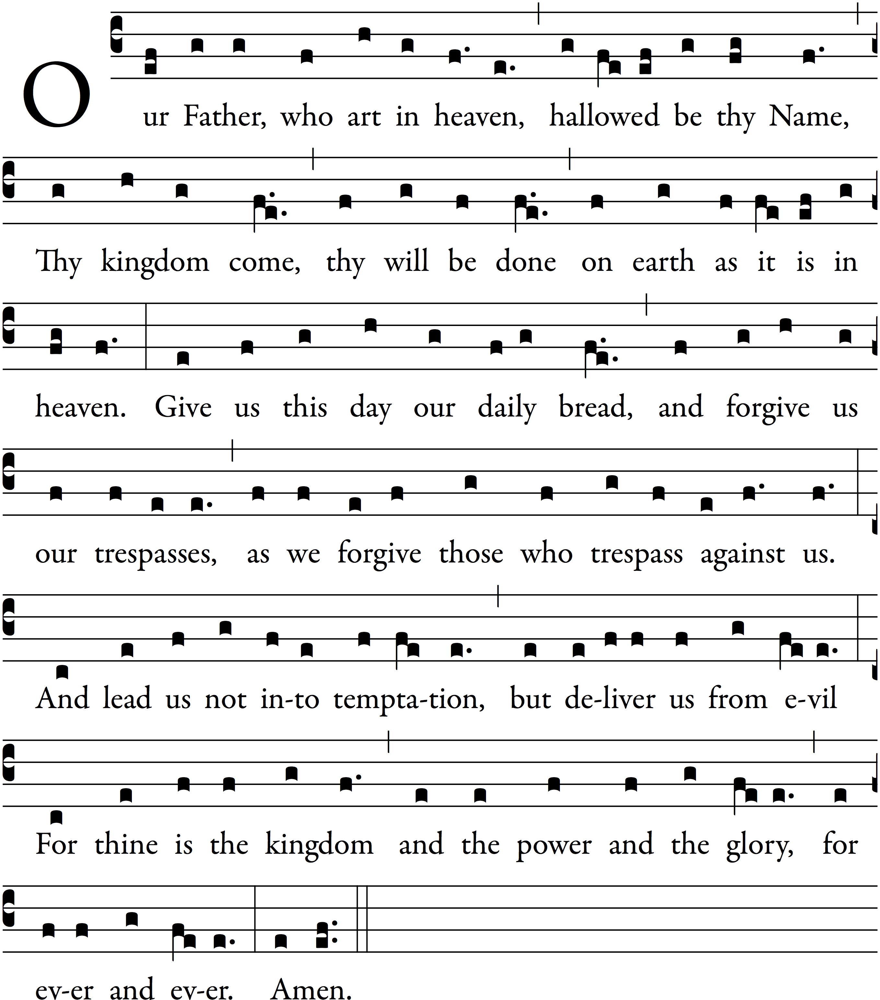

---
header-includes:
    - \usepackage[autocompile]{gregoriotex}
---

# An Order for Evening Prayer | 4 May 2016
_adapted from the Anglican Use_

\gregorioscore{cherubic-hymn}

## Call to Worship

Presider
:    O God, make speed to save us.

People
:    O Lord, make haste to help us.

All
:    Glory to the Father,  
and to the Son,  
and to the Holy Spirit:  
as it was in the beginning, is now, and will be for ever.
:    Amen.

## Evening Hymn (_Phos Hilaron_)

Now sunset comes, but light shines forth,  
the lamps are lit to pierce the night.  
Praise Father, Son, and Spirit, God  
Who dwells in the eternal light.

Worthy are you of endless praise,  
O Son of God, Life-giving Lord;  
wherefore you are through all the earth  
and in the highest heav'n adored.

## Psalmody

### Psalm I --- _Beatus vir qui non abiit_

Blessed is the man that hath not walked in the counsel of the ungodly,  
nor stood in the wáy of sínners \*  
and hath not sat in the séat of the scórnful.

2  But his delight is in the láw of the Lórd \*  
and in his law will he exercise himself dáy and night.

3  And he shall be like a tree plánted by the wáter-side \*  
that will bring forth his fruit in dúe séason.

4  His leaf also sháll not wíther \*  
and look, whatsoever he doeth, ít shall prósper.

5  As for the ungodly, it is not só with thém \*  
but they are like the chaff,  
which the wind scattereth away from the fáce of the éarth.

6  Therefore the ungodly shall not be able to stánd in the júdgement \*  
neither the sinners in the congregátion of the ríghteous.

7  But the Lord knoweth the wáy of the ríghteous \*  
and the way of the ungódly shall pérish.

Glory be to the Fáther and to the Són \*  
and to the Hóly Spírit

As it was in the beginning is now and éver sháll be \*  
world without énd. Amén

### Psalm II --- _Quare fremuerunt gentes?_

WHY do the heathen so furiously ràge togèther? \*  
and why do the people imàgine a vàin thing?

2 The kings of the earth stand up, and the rulers take còunsel togèther \*  
against the LORD, and agàinst his Anòinted:

3 Let us break their bònds asùnder, \*  
and cast away their còrds from ùs.

4 He that dwelleth in heaven shall làugh them to scòrn: \*  
the Lord shall hàve them in derìsion.

5 Then shall he speak unto thèm in his wràth, \*  
and vex them in his sòre displèasure:

6 Yet have I sèt my Kìng \*  
upon my holy hìll of Sìon.

7 I will rehèarse the decrèe; \*  
the LORD hath said unto me, Thou art my Son,  
this day have I begòtten thèe.

8 Desire of me, and I shall give thee the nations for thìne inhèritance, \*  
and the utmost parts of the èarth for thy possèssion.

9 Thou shalt bruise them with a ròd of ìron, \*  
and break them in pieces like a pòtter's vèssel.

10 Be wise now therefore, Ò ye kìngs; \*  
be instructed, ye that are jùdges of the èarth.

11 Serve the LÒRD in fèar, \*  
and rejoice unto hìm with rèverence.

12 Kiss the Son, lest he be angry,  
and so ye perish from the right way,  
if his wrath be kindled, yèa but a lìttle. \*  
Blessed are all they that pùt their trùst in him.

### Psalm III --- _Domine, quid multiplicati?_

LORD, how are they increased that tròuble mè! \*  
many are they that rìse agàinst me.

2 Many one there be that sày of my sòul, \*  
There is no help for hìm in his Gòd.

3 But thou, O LORD, àrt my defènder; \*  
thou art my worship, and the lìfter up of my hèad.

4 I did call upon the LÒRD with my vòice, \*  
and he heard me out of his hòly hìll.

5 I laid me down and slept, and ròse up agàin; \*  
for the LÒRD sustàined me.

6 I will not be afraid for ten thòusands of the pèople, \*  
that have set themselves agàinst me ròund about.

7 Up, LORD, and hèlp me, Ò my God, \*  
for thou smitest all mine enemies upon the cheekbone;  
thou hast broken the tèeth of the ungòdly.

8 Salvation belongeth ùnto the LÒRD; \*  
and thy blessing is upòn thy pèople.

## Lesson --- Ephesians 2:4-6 (DR)

But God, (who is rich in mercy,)
for his exceeding charity wherewith he loved us,
Even when we were dead in sins, hath quickened us together in Christ, (by whose grace you are saved,)
And hath raised us up together, and hath made us sit together in the heavenly places, through Christ Jesus.

## Evening Canticle --- _Magnificat Anima Mea_

My soul doth magnify the Lord, \*  
    and my spirit hath rejoiced in God my Savior.  
For he hath regarded \*  
    the lowliness of his handmaiden.  
For behold from henceforth \*  
    all generations shall call me blessed.  
For he that is mighty hath magnified me, \*  
    and holy is his Name.  
And his mercy is on them that fear him \*  
    throughout all generations.  
He hath showed strength with his arm; \*  
    he hath scattered the proud in the imagination of their hearts.  
He hath put down the mighty from their seat, \*  
    and hath exalted the humble and meek.  
He hath filled the hungry with good things, \*  
    and the rich he hath sent empty away.  
He remembering his mercy hath holpen his servant Israel, \*  
    as he promised to our forefathers,  
    Abraham and his seed for ever.  

Glory to the Father, and to the Son, and to the Holy Spirit:   \*
    as it was in the beginning, is now, and will be for ever.   
    Amen.

## Apostles' Creed

I believe in God, the Father almighty,  
    maker of heaven and earth;

And in Jesus Christ his only Son our Lord;  
    who was conceived by the Holy Ghost,  
    born of the Virgin Mary,  
    suffered under Pontius Pilate,  
    was crucified, dead, and buried.  
    He descended into hell.  
    The third day he rose again from the dead.  
    He ascended into heaven,  
    and sitteth on the right hand of God the Father almighty.  
    From thence he shall come to judge the quick and the dead.

I believe in the Holy Ghost,  
    the holy catholic Church,  
    the communion of saints,  
    the forgiveness of sins,  
    the resurrection of the body,  
    and the life everlasting. Amen.  

## The Prayers

Officiant
:    The Lord be with you.

People
:    And with thy spirit.

Officiant
:    Let us pray.

### The Lord's Prayer

### The Suffrages

That this evening may be holy, good, and peaceful,  
We entreat thee, O Lord.

That thy holy angels may lead us in paths of peace and
goodwill,  
We entreat thee, O Lord.

That we may be pardoned and forgiven for our sins
and offenses,  
We entreat thee, O Lord.

That there may be peace to thyChurch and to the whole
world,  
We entreat thee, O Lord.

That we may depart this life in thy faith and fear,  
and not be condemned before the great judgment seat
of Christ,  
We entreat thee, O Lord.

That we may be bound together by thy Holy Spirit  
in the communion of all thy saints,  
entrusting one another and all our life to Christ,  
We entreat thee, O Lord.

### The Collects

#### of the Day

Almighty God,  
  fill us with a holy joy;  
  teach us how to thank you with reverence and love  
  on account of the ascension of Christ your Son.  
You have raised us up with him:  
  where he, the head, has preceded us in glory,  
  there we, the body, are called in hope.  
Through our Lord Jesus Christ, your Son,  
  who lives and reigns with you and the Holy Spirit,  
  one God, for ever and ever.  

#### for Peace

O God, who art the author of peace and lover of concord,  
in knowledge of whom standeth our eternal life,  
whose service is perfect freedom:  
Defend us, thy humble servants,  
in all assaults of our enemies;  
that we, surely trusting in thy defense,  
may not fear the power of any adversaries;  
through the might of Jesus Christ our Lord.

#### for this Night

Keep watch, dear Lord,  
with those who work, or watch, or weep this night,  
and give thine angels charge over those who sleep.  
Tend the sick, Lord Christ;  
give rest to the weary,  
bless the dying,  
soothe the suffering,  
pity the afflicted,  
shield the joyous;  
and all for thy love's sake.

### The General Thanksgiving

Almighty God, Father of all mercies,  
we thine unworthy servants  
do give thee most humble and hearty thanks  
for all thy goodness and loving-kindness  
to us and to all people.  

We bless thee for our creation, preservation,  
and all the blessings of this life;  
but above all for thine inestimable love  
in the redemption of the world by our Lord Jesus Christ;  
for the means of grace, and for the hope of glory.

And, we beseech thee,  
give us that due sense of all thy mercies,  
that our hearts may be unfeignedly thankful;  
and that we show forth thy praise,  
not only with our lips, but in our lives,  
by giving up our selves to thy service,  
and by walking before thee  
in holiness and righteousness all our days;  
through Jesus Christ our Lord,  
to whom, with thee and the Holy Spirit,  
be all honor and glory, world without end.  
Amen.

### The Prayer of St. Chrysostom

Almighty God,
who hast given us grace at this time, with one accord,  
to make our common supplication unto thee;  
and hast promised through thy well-beloved Son  
that when two or three are gathered together in his Name   thou wilt be in the midst of them:  

Fulfill now, O Lord,
the desires and petitions of thy servants  
as may be best for us;  
granting us in this world knowledge of thy truth,  
and in the world to come life everlasting.  
Amen.

## The Dismisal

Presider
:    The grace of our Lord Jesus Christ,
and the love of God,
and the fellowship of the Holy Ghost,
be with us all evermore.

All
:    Amen.

## Seasonal Marian Hymn --- _Regina Caeli_

